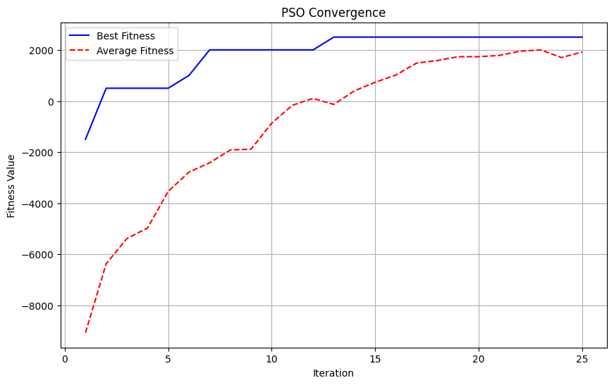
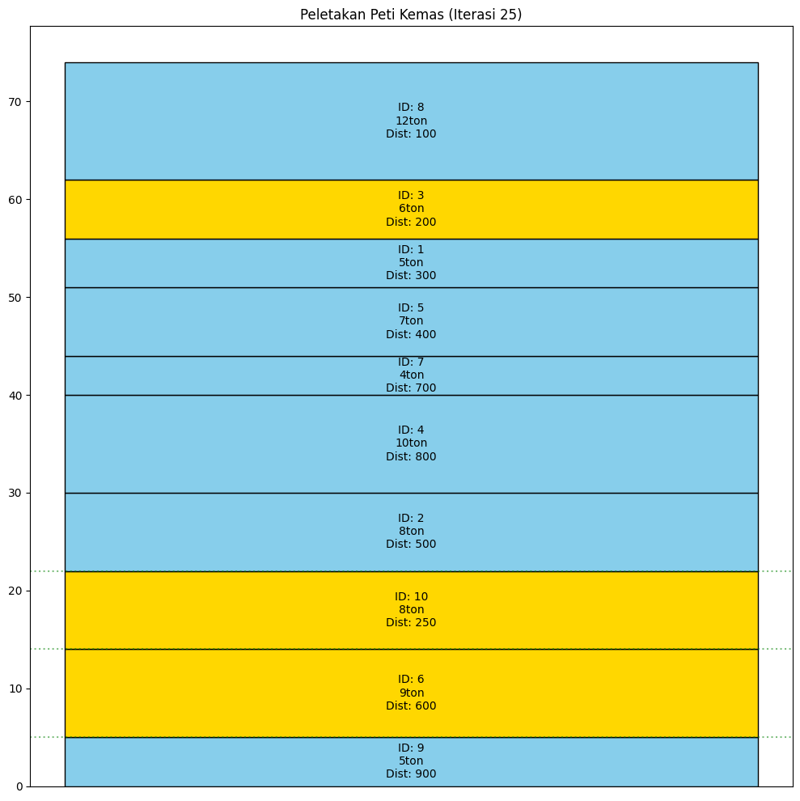

# Particle Swarm Optimization (PSO)

Proyek ini merupakan implementasi algoritma **Particle Swarm Optimization (PSO)** untuk mengoptimalkan susunan peti kemas menggunakan Python dalam format Jupyter Notebook. PSO adalah algoritma optimasi berbasis populasi yang terinspirasi dari perilaku sosial kawanan burung atau ikan dalam pencarian makanan.

##  Instalasi

Pastikan Python sudah terinstal, lalu pasang pustaka berikut:

```bash
pip install numpy matplotlib
```

---

##  Fitur

- Implementasi PSO dari nol menggunakan Python.
- Visualisasi konvergensi partikel.
- Dapat digunakan untuk optimasi fungsi matematis sederhana.
- Parameter seperti jumlah partikel, iterasi, dan koefisien PSO dapat dikonfigurasi.

##  Cara Menjalankan

1. Pastikan Anda memiliki Python 3.8+ dan Jupyter Notebook terinstal.
2. Clone repository ini:
   ```bash
   git clone https://github.com/AurumNuraga/PSO_Container_Management.git
   cd nama-repo
   ```
3. Buka notebook:
   ```bash
   jupyter notebook PSO.ipynb
   ```

##  Contoh Output

Notebook menyertakan grafik dan gambar yang menginformasikan fitness dan bentuk partikel.



